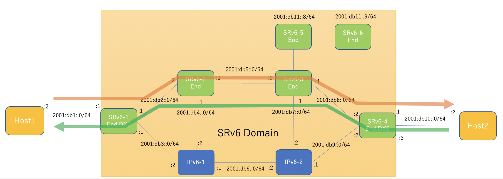
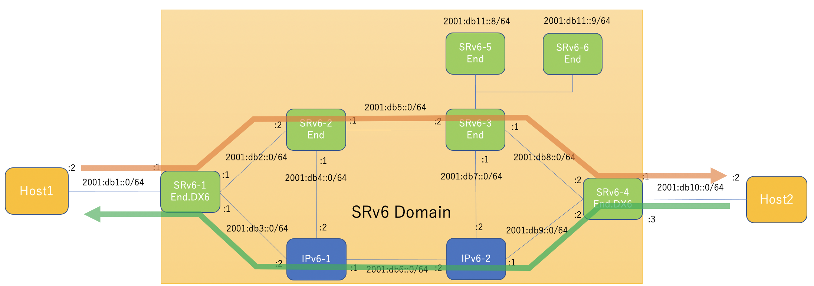

# srv6-linux-ground
One touch Build SRv6 Network Namespace with vagrant

# Topology


## Run 
```
git clone <git repository>
cd srv6-netns-demo
vagrant up
vagrant ssh
sudo su -
bash scripts/01_create-namespaces.sh
bash scripts/02_create-quagga.sh
bash scripts/03_create-ospf6.sh
bash scripts/04_create_srv6.sh
```

## how to use

```
# ping from host1 to host2
ip netns exec host1 ping6 2001:db10::2

# tcpdump sample 
# Topology を参考にパケット収集したい veth を指定してください
ip netns exec srv6-2 tcpdump -i veth-sr2-sr3
```

### Demo1

```
## Demo1用にルーティングテーブル変更
ip netns exec srv6-1 ip -6 rule add to 2001:db10::/64 lookup localsid1
ip netns exec srv6-4 ip -6 rule add to 2001:db1::/64 lookup localsid1
```

### Demo2

```
## Demo2用にルーティングテーブル変更
ip netns exec srv6-4 ip -6 rule add to 2001:db1::/64 lookup localsid2
```

### Demo3

```
## Demo3用にルーティングテーブル変更
ip netns exec srv6-1 ip -6 rule add to 2001:db10::/64 lookup localsid2
```

### Demo4

```
## Demo4用にルーティングテーブル変更
ip netns exec srv6-1 ip -6 rule add to 2001:db10::/64 lookup localsid3
```
